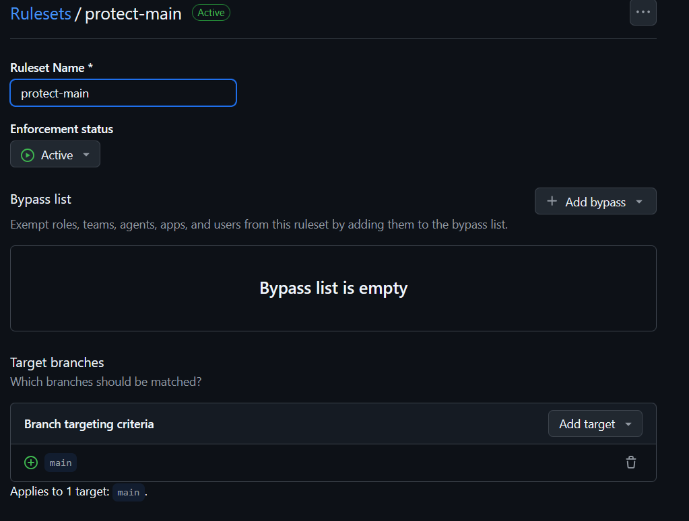
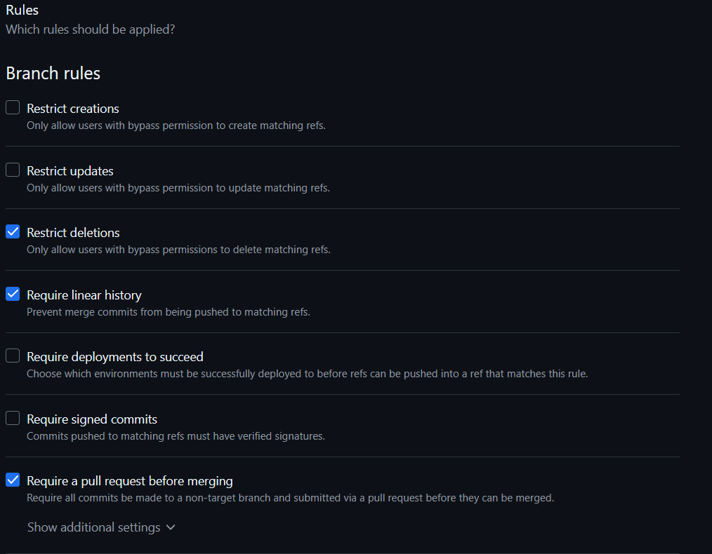
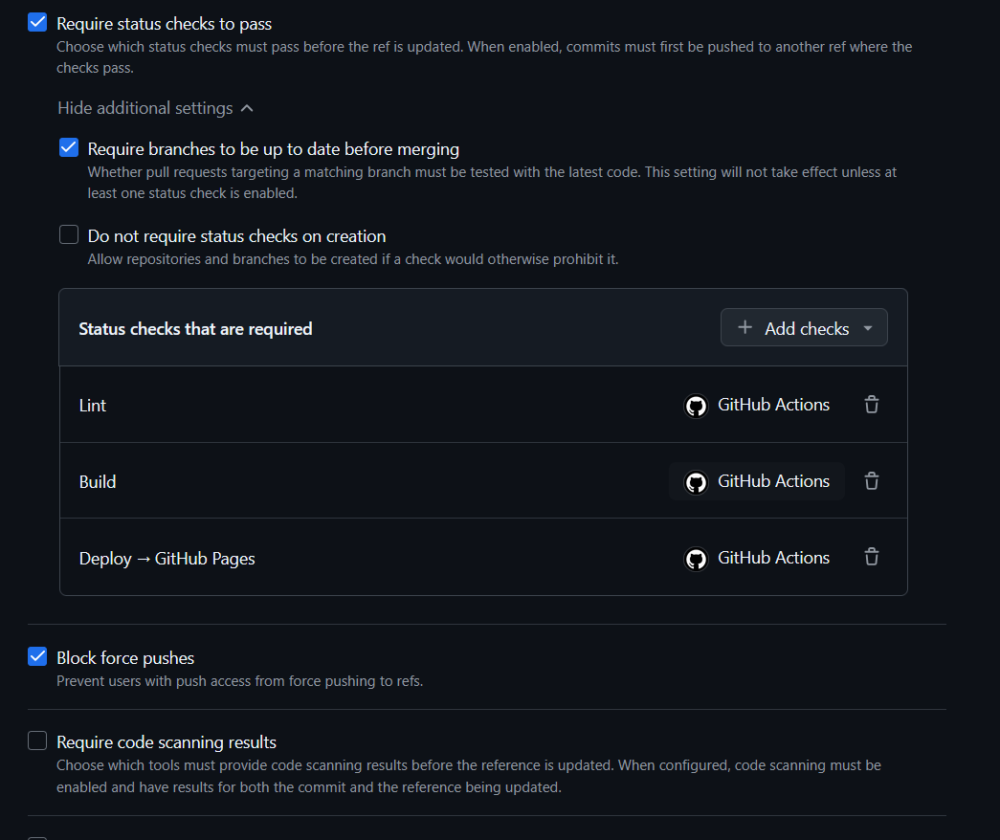

# ds881-curriculo-GRR20240555


Currículo online desenvolvido com [Astrofy](https://github.com/manuelernestog/astrofy) como atividade prática da disciplina DS881.

🔗 **[Ver currículo em produção](https://edukaique.github.io/ds881-curriculo-GRR20240555/)**

---

## 📋 Sobre o Projeto

Site estático de currículo/portfólio pessoal, hospedado no GitHub Pages. O projeto aplica conceitos de conteinerização com Docker, automação de CI/CD com GitHub Actions e governança de código com Branch Protection e Pull Requests.

**Stack:**

- [Astro](https://astro.build/) com o template [Astrofy](https://github.com/manuelernestog/astrofy)
- Docker + Docker Compose para ambiente de desenvolvimento local
- GitHub Actions para pipeline de CI/CD
- GitHub Pages para hospedagem

---

## 🐳 Executando Localmente com Docker

### Pré-requisitos

- [Docker Desktop](https://www.docker.com/products/docker-desktop/) instalado e em execução.

### Passo a passo

**1. Clone o repositório:**

```bash
git clone https://github.com/EduKaique/ds881-curriculo-GRR20240555.git
cd ds881-curriculo-GRR20240555
```

**2. Suba o ambiente de desenvolvimento:**

```bash
docker compose up --build
```

**3. Acesse no navegador:**

```
http://localhost:8080
```

O servidor utiliza **hot reload** — qualquer alteração salva nos arquivos do projeto é refletida automaticamente no navegador, sem precisar reiniciar o contêiner.

**4. Para encerrar:**

```bash
docker compose down
```

> **Nota:** Na primeira execução o Docker irá baixar a imagem base e instalar as dependências. As execuções seguintes serão mais rápidas graças ao cache de camadas.

---

## ⚙️ Pipeline de CI/CD

O workflow `.github/workflows/main.yml` é acionado automaticamente:

| Evento                               | Jobs executados             |
| :----------------------------------- | :-------------------------- |
| Abertura de Pull Request para `main` | `lint` → `build`            |
| Merge / push na `main`               | `lint` → `build` → `deploy` |

| Job           | Descrição                                                                 |
| :------------ | :------------------------------------------------------------------------ |
| 🔍 **Lint**   | Analisa o código com ESLint (`eslint-plugin-astro` + `typescript-eslint`) |
| 🏗️ **Build**  | Compila o site Astro e gera o artefato de deploy                          |
| 🚀 **Deploy** | Publica o artefato no GitHub Pages via `actions/deploy-pages`             |

---

## 🛡️ Proteção da Branch `main`

A branch `main` está configurada com as seguintes regras no GitHub:

- ✅ Pull Request obrigatório antes do merge
- ✅ Pipeline de CI deve estar verde para liberar o merge
- ✅ Push direto na `main` bloqueado

> 📸 **Print da configuração de Branch Protection:**
>
> 
> 
> 

---

## 📁 Estrutura do Projeto

```
.
├── .github/
│   └── workflows/
│       └── main.yml          # Pipeline de CI/CD
├── src/                      # Código-fonte Astro (pages, components, etc.)
├── public/                   # Assets estáticos
├── Dockerfile                # Imagem Docker para desenvolvimento
├── docker-compose.yml        # Configuração do ambiente de desenvolvimento
├── eslint.config.mjs         # Configuração do ESLint
└── astro.config.mjs          # Configuração do Astro
```

---

## 📝 Padrão de Commits

Este projeto segue o padrão [Conventional Commits](https://www.conventionalcommits.org/):

```
feat: adiciona seção de projetos
fix: corrige link do LinkedIn
ci: atualiza versão da action do Astro
docs: adiciona instruções de docker no README
style: ajusta espaçamento do header
```
